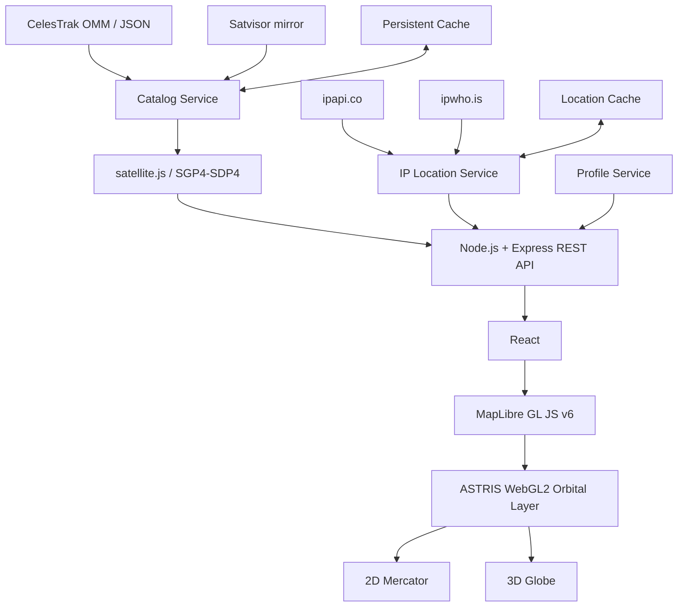

# ASTRIS

**Advanced Satellite Tracking & Real-time Interactive System**

**Офіційна назва проєкту:**  
**«Вебсистема інтерактивного моніторингу та візуалізації орбітального руху штучних супутників Землі»**

> **Поточний baseline: `v0.2.0`**  
> Full-stack вебсистема для інтерактивного відображення GNSS- та Starlink-супутників у 2D/3D, розрахунку їх положення за SGP4/SDP4, аналізу видимості відносно спостерігача та візуалізації орбітальних характеристик.

---

## Що змінилося у v0.2.0

`v0.2.0` — перший структурний major-baseline ASTRIS після серії `v0.1.x`.

Основні зміни:

- повністю впорядкована структура репозиторію;
- React entrypoint винесений у `client/src/app/`;
- UI-компоненти розділені на `components/common` і `components/map`;
- усі CSS-файли зібрані в `client/src/styles/`;
- starfield-ресурси винесені в `client/src/assets/starfield/`;
- картографічний код розділений на `map/config`, `map/geometry` та `map/rendering`;
- server runtime перенесений у `server/src/`, а tests/benchmarks залишені окремими доменами;
- історичні release/validation-файли перенесені в `docs/releases/v0.1.x` і `docs/validation/history`;
- активний validator розміщено в `tools/validation/current/`;
- **MapLibre GL JS оновлено з `5.24.0` до `6.9.0`**;
- для Vite налаштовано окремий MapLibre ESM worker через `?worker&url`;
- custom orbital renderer переведено на публічний projection API MapLibre v6 (`shaderData`, `defaultProjectionData`, `projectTileFor3D`);
- прибрано залежність від внутрішнього `map.transform` і v5-era camera monkey patches;
- координати орбітальних вершин зберігаються у GPU-friendly normalized Mercator form, а Globe/Mercator projection виконує MapLibre shader pipeline;
- збережено виділені dev-порти ASTRIS: **5174 / 3101**.

### Чому оновлено MapLibre

У `v0.1.20` ASTRIS оптимізував власні VBO та GL state, але Chrome warning залишився. Стек помилки проходив через внутрішній MapLibre globe-path (`_renderErrorTexture → updateErrorLoop → updateGPUdependent`).

Сучасний MapLibre прибрав старий runtime GPU latitude-correction механізм, який періодично малював 1×1 framebuffer для вимірювання GPU `atan` error. У новій реалізації latitude обчислюється через `exp()` і раціональну математику без такого readback/correction loop.

Тому `v0.2.0` виправляє проблему на рівні реального джерела, а не намагається далі оптимізувати лише ASTRIS VBO поверх старого MapLibre v5.

> MapLibre v6 вимагає **WebGL2**.

### Оновлення з v0.1.20

Через реорганізацію директорій **не рекомендується просто розпаковувати v0.2.0 поверх старого v0.1.20 без видалення переміщених файлів**. Найчистіший варіант — використати FULL SOURCE v0.2.0. Для ручної міграції див. `docs/releases/v0.2.0/MIGRATION_v0.1.20_TO_v0.2.0.md`.

---

## Про проєкт

ASTRIS — самостійний навчально-практичний full-stack проєкт для роботи з актуальними орбітальними даними штучних супутників Землі.

Система:

1. отримує orbital elements із зовнішніх каталогів;
2. нормалізує та кешує їх на сервері;
3. виконує propagation за SGP4/SDP4;
4. формує orbital scene через REST API;
5. передає сцену React-клієнту;
6. візуалізує супутники, орбіти та observer geometry через MapLibre + custom WebGL2 layer.

Основний технологічний стек:

- **React 19.2.7** — клієнтський інтерфейс;
- **Vite 8.1.0** — development/build pipeline;
- **MapLibre GL JS 6.9.0** — 2D/3D cartographic renderer;
- **WebGL2** — custom orbital rendering;
- **Node.js 22+** — серверне середовище;
- **Express 5.2.1** — REST API;
- **satellite.js 7.1.0** — SGP4/SDP4 propagation і координатні перетворення;
- **CelesTrak OMM/JSON** — основне джерело orbital elements.

---

## Основні можливості

### Супутникові каталоги

ASTRIS підтримує:

- GPS;
- GLONASS;
- Galileo;
- BeiDou;
- QZSS;
- SBAS;
- Starlink.

GNSS і Starlink можуть вмикатися незалежно.

### 2D / 3D

Доступні:

- 2D Mercator map;
- 3D Globe;
- altitude-aware satellite markers;
- orbital tracks;
- labels;
- coordinate graticule;
- atmosphere;
- day/night model;
- synthetic starfield;
- 3D buildings для сумісних map styles;
- terrain;
- декілька базових карт.

### Орбітальна математика

Server-side pipeline виконує:

- OMM → satellite record;
- SGP4/SDP4 propagation;
- ECI / ECF / geodetic transformations;
- longitude / latitude / altitude;
- azimuth;
- elevation angle;
- range;
- full orbit tracks;
- horizon/visibility filtering.

### Положення спостерігача

ASTRIS підтримує:

1. **Approximate IP location** — приблизне визначення координат за публічною IP-адресою;
2. **Manual observer** — ручне введення latitude/longitude.

Остання коректна позиція кешується і може бути використана при тимчасовій недоступності IP provider.

> IP location — це приблизна геолокація, а не GNSS fix.

### Пошук і вибір супутника

Пошук працює по активних каталогах. Вибраний satellite може використовуватись для:

- перегляду orbital metadata;
- highlight на карті;
- побудови орбіти;
- observer analysis;
- LOS/coverage visualization.

### LOS і coverage

Передбачені:

- Line of Sight observer → satellite;
- coverage geometry;
- selected-satellite coverage;
- minimum elevation angle.

Ці режими є геометричною візуалізацією і не замінюють професійний RF link-budget.

### Profiles

Map/profile state може містити:

- map layer;
- projection;
- view state;
- orbital overlay settings;
- active constellations;
- observer position;
- visual scene parameters.

Profiles зберігаються server-side та можуть експортуватися у JSON.

---

## Архітектура



Data flow:

```text
CelesTrak / mirror / persistent cache
                ↓
       Node.js Catalog Service
                ↓
        satellite.js / SGP4
                ↓
           Express REST API
                ↓
               React
                ↓
       MapLibre v6 + WebGL2
                ↓
         2D Map / 3D Globe
```

---

## Структура репозиторію

```text
ASTRIS/
├── client/
│   ├── public/
│   │   ├── icons/
│   │   │   └── astris-favicon.svg
│   │   └── map-previews/
│   │
│   └── src/
│       ├── app/
│       │   ├── App.jsx
│       │   └── main.jsx
│       │
│       ├── assets/
│       │   └── starfield/
│       │
│       ├── components/
│       │   ├── common/
│       │   │   ├── AstrisEntryLoader.jsx
│       │   │   └── AstrisMapErrorBoundary.jsx
│       │   └── map/
│       │       ├── AstrisMapWidget.jsx
│       │       └── OrbitalMap.jsx
│       │
│       ├── lib/
│       │   ├── colors.js
│       │   ├── geo.js
│       │   └── mapStyleExpressions.js
│       │
│       ├── map/
│       │   ├── config/
│       │   │   └── MapSettingsStore.js
│       │   ├── geometry/
│       │   │   ├── OrbitalCoverageFootprint.js
│       │   │   ├── OrbitalLineOfSight.js
│       │   │   └── dayNightModel.js
│       │   └── rendering/
│       │       ├── AstrisOrbitalLayer.js
│       │       └── projectionMath.js
│       │
│       ├── profiles/
│       │   └── useAstrisProfiles.js
│       │
│       └── styles/
│           ├── globals.css
│           ├── entry-loader.css
│           └── map-parity.css
│
├── server/
│   ├── src/
│   │   ├── index.mjs
│   │   ├── routes/
│   │   └── services/
│   ├── test/
│   ├── bench/
│   ├── cache/
│   ├── data/
│   └── reports/
│
├── tools/
│   └── validation/
│       ├── current/
│       └── history/
│
├── docs/
│   ├── architecture/
│   ├── planning/
│   ├── releases/
│   │   ├── v0.1.x/
│   │   └── v0.2.0/
│   └── validation/
│       ├── current/
│       └── history/
│
├── CHANGELOG.md
├── README.md
├── package.json
└── .gitignore
```

Детальні правила розміщення файлів: `docs/architecture/REPOSITORY_STRUCTURE.md`.

### Правила структури

- **CSS** → `client/src/styles/`;
- **React app entrypoints** → `client/src/app/`;
- **reusable UI** → `client/src/components/`;
- **map config/state** → `client/src/map/config/`;
- **geometry/math related to map scene** → `client/src/map/geometry/`;
- **WebGL / render pipeline** → `client/src/map/rendering/`;
- **static imported assets** → `client/src/assets/`;
- **public static files** → `client/public/`;
- **server runtime** → `server/src/`;
- **tests** → `server/test/`;
- **benchmarks** → `server/bench/`;
- **release docs** → `docs/releases/<version>/`;
- **old validation** → `docs/validation/history/`;
- **active validation scripts** → `tools/validation/current/`.

---

## MapLibre v6 / WebGL2 renderer

ASTRIS `v0.2.0` використовує projection-aware custom layer.

Custom shader отримує від MapLibre:

```text
shaderData.vertexShaderPrelude
shaderData.define
defaultProjectionData.mainMatrix
defaultProjectionData.fallbackMatrix
defaultProjectionData.tileMercatorCoords
defaultProjectionData.clippingPlane
defaultProjectionData.projectionTransition
```

Satellite vertices зберігаються як normalized Mercator coordinates `0..1`, а projection виконується shader-функцією MapLibre:

```text
projectTileFor3D(...)
```

Це дозволяє одному geometry buffer коректно працювати і в Mercator, і в Globe, без CPU-перерахунку всіх satellite vertices при кожному camera frame.

### GPU buffer policy

ASTRIS зберігає bounded VBO ring для часто оновлюваних orbital buffers та не робить synchronous `gl.getParameter()` readbacks у custom layer.

Камера, globe transition і projection математика залишаються відповідальністю MapLibre v6.

---

## Відмовостійкість зовнішніх сервісів

### Orbital catalogs

```text
CelesTrak
    ↓ failure / rate limit
Satvisor mirror
    ↓
persistent last-known-good cache
```

ASTRIS:

- дотримується refresh floor для GP/OMM каталогів;
- має cooldown після `403`, `429` та provider failures;
- використовує backoff;
- продовжує роботу зі stale last-known-good cache;
- не показує raw provider HTML error page у dashboard.

### IP location

```text
ipapi.co
    ↓ failure
ipwho.is
    ↓ failure
persistent location cache
    ↓
browser last observer
```

---

## Persistent cache

За замовчуванням cache живе поза source tree.

### Windows

```text
%LOCALAPPDATA%\ASTRIS\cache
```

### macOS

```text
~/Library/Caches/ASTRIS
```

### Linux

```text
~/.cache/astris
```

Перевизначення:

```text
ASTRIS_CACHE_DIR
```

---

## Системні вимоги

Рекомендовано:

- **Node.js >= 22.13.0**;
- npm;
- актуальний Chrome / Edge / Firefox / Safari;
- **WebGL2-capable GPU/browser**;
- Internet connection для першого завантаження orbital catalog та approximate IP location.

---

## Встановлення

```bash
git clone https://github.com/<username>/<repository>.git
cd <repository>
npm install
```

Проєкт використовує npm workspaces:

```text
client
server
```

---

## Запуск development environment

```bash
npm run dev
```

За замовчуванням:

```text
Frontend: http://localhost:5174
API:      http://localhost:3101
```

ASTRIS використовує окремі порти, щоб не конфліктувати з IRMAS.

---

## Основні npm-команди

| Команда | Призначення |
|---|---|
| `npm run dev` | server + client |
| `npm run server` | Node.js API |
| `npm run client` | Vite client |
| `npm run build` | client production build |
| `npm test` | server tests |
| `npm run check` | validator + tests + build |
| `npm run check:map-parity` | v0.2.0 structural/map regression gate |
| `npm run check:render-budget` | render budget check |
| `npm run bench:scene` | orbital scene benchmark |

---

## Production build

```bash
npm run build
```

Результат:

```text
client/dist/
```

Server:

```bash
npm run start --workspace astris-server
```

Client preview:

```bash
npm run preview --workspace astris-client
```

---

## Конфігурація

| Environment variable | Default | Призначення |
|---|---:|---|
| `ASTRIS_HOST` | `0.0.0.0` | Express host |
| `ASTRIS_PORT` | `3101` | API port |
| `ASTRIS_CLIENT_PORT` | `5174` | Vite port |
| `ASTRIS_API_TARGET` | `http://127.0.0.1:3101` | Vite `/api` proxy target |
| `ASTRIS_CACHE_DIR` | OS-specific | persistent cache |

PowerShell example:

```powershell
$env:ASTRIS_PORT = "3101"
$env:ASTRIS_CLIENT_PORT = "5174"
$env:ASTRIS_CACHE_DIR = "D:\ASTRIS_CACHE"
npm run dev
```

Linux/macOS:

```bash
ASTRIS_PORT=3101 ASTRIS_CLIENT_PORT=5174 npm run dev
```

---

## REST API

### Health

```http
GET /api/health
```

Очікуваний baseline:

```json
{
  "ok": true,
  "product": "ASTRIS",
  "version": "0.2.0"
}
```

### Observer location

```http
GET /api/location
```

### Catalog status

```http
GET /api/catalog/status
```

### Catalog refresh

```http
POST /api/catalog/refresh?catalogs=GNSS,STARLINK
```

### Satellite search

```http
GET /api/orbits/search
```

### Orbital scene

```http
GET /api/orbits/scene
```

### Profiles

```http
GET    /api/profiles
GET    /api/profiles/export
GET    /api/profiles/:name
PUT    /api/profiles/:name
DELETE /api/profiles/:name
```

---

## Надійність UI

ASTRIS map subsystem ізольований `AstrisMapErrorBoundary`.

Неочікувана помилка map renderer не повинна прибирати весь React UI — failure локалізується у map area.

Починаючи з `v0.2.0`, MapLibre v6 також вимагає WebGL2. Якщо GPU/browser не може створити WebGL2 context, map initialization має вважатися environment/GPU initialization failure, а не orbital-data failure.

---

## Валідація

Активний gate:

```text
tools/validation/current/validate-v020.mjs
```

Запуск:

```bash
npm run check:map-parity
```

Історичні validators збережені в:

```text
tools/validation/history/
```

Validation reports:

```text
docs/validation/current/
docs/validation/history/
```

---

## Обмеження

ASTRIS є інформаційно-візуалізаційною та навчальною системою.

Проєкт не призначений для:

- керування космічними апаратами;
- safety-critical flight dynamics;
- сертифікованого collision avoidance;
- високоточної GNSS-геодезії;
- професійного RF link-budget;
- використання як єдиного джерела даних у safety-critical системах.

Точність залежить від:

- актуальності orbital elements;
- SGP4/SDP4 model assumptions;
- observer coordinates;
- часу системи;
- доступності provider.

---

## Основні зовнішні джерела

- [CelesTrak](https://celestrak.org/NORAD/elements/)
- [CelesTrak GP data formats](https://celestrak.org/NORAD/documentation/gp-data-formats.php)
- [CelesTrak usage policy](https://celestrak.org/usage-policy.php)
- [satellite.js](https://github.com/shashwatak/satellite-js)
- [MapLibre GL JS](https://maplibre.org/maplibre-gl-js/docs/)
- [React](https://react.dev/)
- [Vite](https://vite.dev/)
- [Express](https://expressjs.com/)
- [ipapi.co](https://ipapi.co/)
- [ipwho.is](https://ipwho.is/)

Map layers можуть використовувати OpenFreeMap, OpenStreetMap, CARTO, Esri та інші providers; attribution конкретного шару відображається у map UI.

---

## Академічне призначення

ASTRIS може використовуватися як практичний приклад:

- full-stack web development;
- REST API;
- React architecture;
- external API integration;
- GIS/web mapping;
- WebGL2 rendering;
- SGP4 orbital propagation;
- fault-tolerant caching;
- performance profiling;
- 2D/3D geospatial visualization.

---

## Поточна версія

```text
ASTRIS v0.2.0
Repository Reorganization + MapLibre 6 Globe Renderer Migration
```

Повна історія змін:

```text
CHANGELOG.md
```

---

## License

Окремий `LICENSE` у поточному baseline не визначений.

Перед публічним поширенням репозиторію слід додати явну ліцензію відповідно до обраної моделі розповсюдження.

---

**ASTRIS — Advanced Satellite Tracking & Real-time Interactive System**
